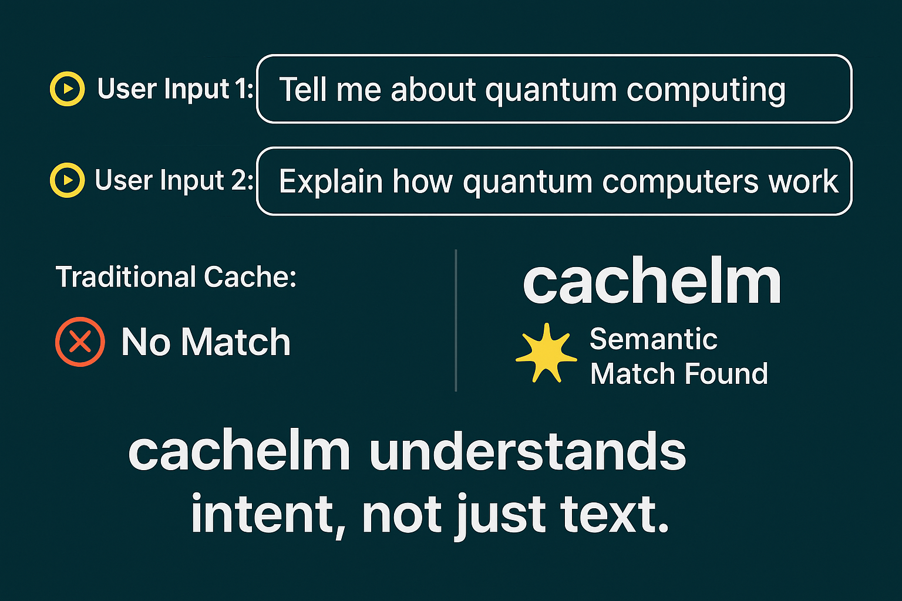

# cachelm 🌟

**cachelm** is a semantic caching layer designed to supercharge your LLM applications by intelligently caching responses based on **meaning** rather than exact text matches. Reduce API costs, improve response times, and maintain context-aware interactions—even with nuanced queries.

**Problem Solved:** Traditional caching fails with LLMs because users rephrase similar queries. cachelm understands intent through semantic similarity, serving cached responses when equivalent requests occur.

---


---

## Why cachelm? 🚀

- **Cut LLM API Costs** by 20-40% through reduced redundant requests
- **Slash Response Times** from seconds to milliseconds for repeated queries
- **Context-Aware Caching** that understands paraphrased requests
- **Future-Proof Architecture** with pluggable components for any LLM/vector DB
- **Seamless Integration** works with your existing OpenAI client code

**Perfect For:**
- High-traffic LLM applications
- Cost-sensitive production deployments
- Real-time chatbots & virtual assistants
- Applications with complex query patterns

---

## Features ✨

| Feature | Benefit |
|---------|---------|
| **Semantic Similarity Matching** | Recognize paraphrased queries as equivalent |
| **Modular Design** | Swap databases/vectorizers without code changes |
| **Streaming Support** | Full compatibility with streaming responses |
| **Production-Ready** | Battle-tested with ChromaDB, Redis, and OpenAI |
| **Extensible Core** | Add new providers in <50 lines of code |

---

## Quick Start 🛠️

### Installation
```bash
pip install git+https://github.com/devanmolsharma/cachelm
```

### Basic Usage (OpenAI + ChromaDB)
```python
from cachelm.adaptors.openai import OpenAIAdaptor
from cachelm.databases.chroma import ChromaDatabase
from cachelm.vectorizers.fastembed import FastEmbedVectorizer
from openai import AsyncOpenAI

# 1. Create components
database = ChromaDatabase(vectorizer=FastEmbedVectorizer())
adaptor = OpenAIAdaptor(
    module=AsyncOpenAI(api_key="sk-your-key"),
    database=database,
    distance_threshold=0.15  # Controls match sensitivity (lower = stricter)
)

# 2. Get enhanced client
smart_client = adaptor.get_adapted()

# 3. Use like regular OpenAI client - now with auto-caching!
response = await smart_client.chat.completions.create(
    messages=[{"role": "user", "content": "Explain quantum computing"}],
    model="gpt-3.5-turbo"
)

# Subsequent similar queries get cached responses!
cached_response = await smart_client.chat.completions.create(
    messages=[{"role": "user", "content": "Break down quantum computing basics"}],  # Different wording
    model="gpt-3.5-turbo" 
)
```

---

## Architecture 🧠


**Key Components:**
- **Adaptors**: LLM API wrappers (OpenAI, Anthropic, etc.)
- **Vectorizers**: Text → Embedding converters (FastEmbed, SentenceTransformers)
- **Databases**: Vector stores with similarity search (Chroma, Redis, ClickHouse)

---

## Enterprise-Grade Configurations 🏢

### Redis + RedisVL Performance Setup
```python
from cachelm.databases.redis import RedisDatabase
from cachelm.vectorizers.redisvl import RedisVLVectorizer

database = RedisDatabase(
    vectorizer=RedisVLVectorizer("your-model-name"),
    redis_url="redis://localhost:6379",
    index_name="llm_cache"
)
```

### ClickHouse Cloud Scale-Out
```python
from cachelm.databases.clickhouse import ClickHouse
from cachelm.vectorizers.fastembed import FastEmbedVectorizer

database = ClickHouse(
    vectorizer=FastEmbedVectorizer(),
    host="your.clickhouse.cloud",
    port=8443,
    username="admin",
    password="your-password"
)
```


## Supported Integrations 🔌

| Category       | Technologies |
|----------------|--------------|
| **Databases**  | ChromaDB, Redis, ClickHouse |
| **Vectorizers**| FastEmbed, RedisVL, Chroma |
| **LLMs**       | OpenAI (More coming!) |

---

## Extending cachelm 🔧

**Add New Vectorizer:**
```python
from cachelm.vectorizers.vectorizer import Vectorizer

class MyVectorizer(Vectorizer):
    def embed(self, text: str) -> list[float]:
        return my_embedding_model(text)

    def embedMany(self, texts: list[str]) -> list[list[float]]:
        return [my_embedding_model(t) for t in texts]
```

**Add New Database:**
```python
from cachelm.databases.database import Database

class MyDatabase(Database):
    def connect(self) -> bool:
        # Connect to your vector DB
        return True

    def disconnect(self):
        # Disconnect logic
        pass

    def write(self, history: list[str], response: str):
        # Store (history, response) in your DB
        pass

    def find(self, history: list[str], distance_threshold=0.9) -> str | None:
        # Search for similar history in your DB
        return None
```


## Contributing 🤝

We welcome extensions for:
- New LLM providers (Anthropic, Cohere, etc.)
- Additional vector databases
- Novel caching strategies

See our [Contribution Guide](CONTRIBUTING.md) to get started!

---

## License 📄

MIT - Free for commercial and personal use

---

**Ready to Accelerate Your LLM Workloads?**  
[Get Started Now](#quick-start) | [Report Issue](https://github.com/devanmolsharma/cachelm/issues)